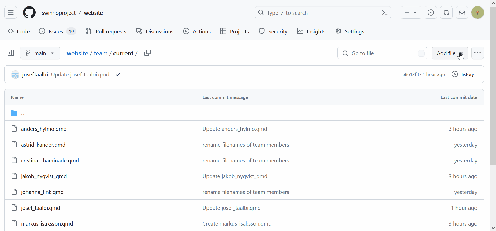
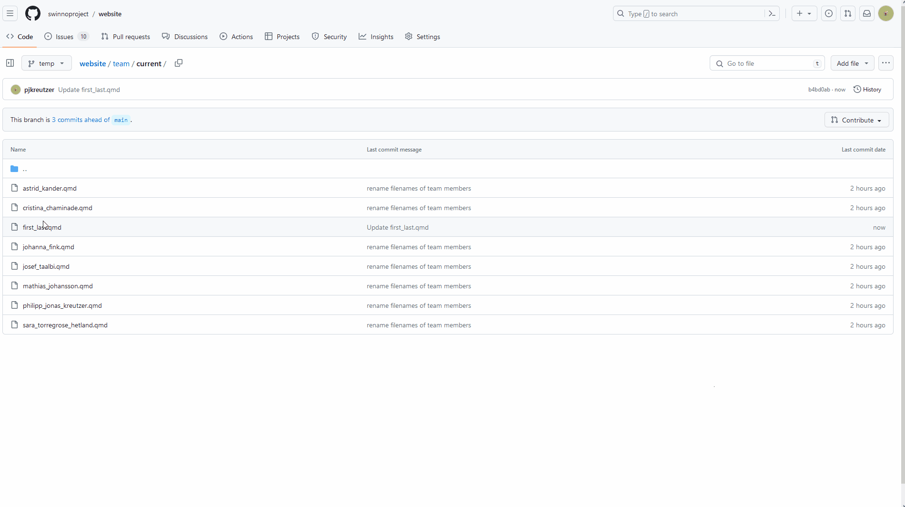
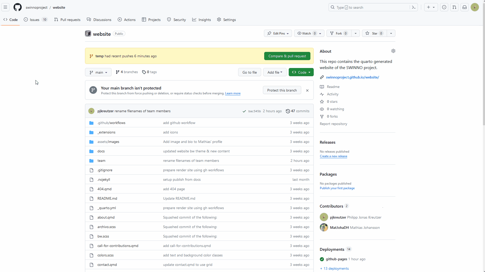

# Repo for SWINNO's website

## Usage

The easiest way to update this website is to edit a document directly on github.
Go to the file that you wish to change make your changes and then click on the pen icon and begin editing.
When you are happy with the edit, click on the green button "Commit changes".
You will be prompted to write a commit message, but for simple changes you can accept the default that is already filled in.
Make sure that you commit directly in the main branch (the default option) and click on commit changes once more.
That is it!
A workflow should now be triggered that updates the websites.
It can take a few minutes for your changes to appear and do not forget to refresh the site.

### Example: Mangaging Team Member Pages

To illustrate how to add and change content, this section walks you step by step through creating a new file, changing existing files and uploading new files from your computer.

1. Creating a new file:

    Go to the folder in which you want to create a new file.
    To create a new current team member profile, go to  `team/current`.
    In the top right of the page you see a button `Add file`.
    Click on it and select `Create new file`.
    You can enter some content (see next step), cancel the file creation or "save" the new file by clicking on the green button `Commit changes`.
    A new window opens where you can describe what you have changed, or simply commit by clicking on the green button again.

    {fig-alt="A GIF showing the steps above"}

2. Make changes to a file:

    Go to the file you want to change.
    Click on the pen icon in the top right corner to begin editing.
    Make your changes.
    When you are done making your changes, click on the green `Commit changes` button, add or accept the message to go with the new changes and click on commit again.

    {fig-alt="A GIF showing the steps above"}


    To help you get started creating a new personal profile, you can copy paste the template below and modify it.
    You can delete the links that you do not need (the two lines starting with - icon: / -text: and href:). 

        ```
        ---
        title: "First Last"
        subtitle: Role
        image: ../../assets/images/FirstLast.jpg
        about:
            template: broadside
            links:
                - icon: person-fill
                    href: link to personal website
                - icon: mortarboard-fill
                    href: link to google scholar
                 - text: ""
                    href: link to your orcid profile
                - icon: twitter
                    href: link to social media
                - icon: github
                    href: https://github.com/first_last
                - text: ""
                    href: mailto:first_last@ekh.lu.se

        toc: false
        ---

        :::{.text-bigger}
        A short description.
        :::

        ```
3. Upload files from your computer

    Now, let's add an image.
    Pay attention that the image file name on your computer matches the name in `image: ../../assets/images/FirstLast.jpg`.
    In this case that would be `FirstLast.jpg`.
    Go to `assets/images` and click on `Add file` in the top right corner.
    This time, choose `Upload files`.
    Drag and drop, or search, for the file you want to upload.
    Click on commit as in the previous steps.

    {fig-alt="A GIF showing the steps above"}
